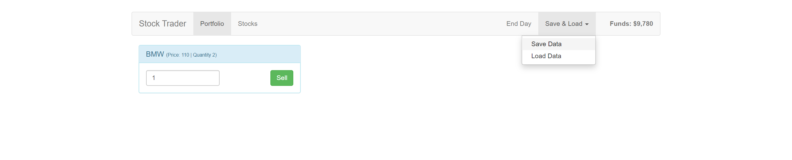

# Stock Trader




Buy and sell different stocks. A responsive single-page application from the final project from Maximilian Schwarzmüller's VueJS2 course.

This uses Vue, Vuex, Bootstrap, and Firebase Realtime Database.


### Features 
* Saving and loading progress from a database
* Input validation and visualization
* Animations between routes


### Build Setup

Use or create a Firebase Realtime Database in **Test** mode. Further details can be found in [Firebase documentation](https://firebase.google.com/docs/database/web/start). Use your Realtime Database URL in [src/main.js](src/main.js). Finally,

``` bash
# install dependencies
npm install

# serve with hot reload at localhost:8080
npm run dev

# build for production with minification
npm run build
```

For detailed explanation on how things work, consult the [docs for vue-loader](http://vuejs.github.io/vue-loader).


